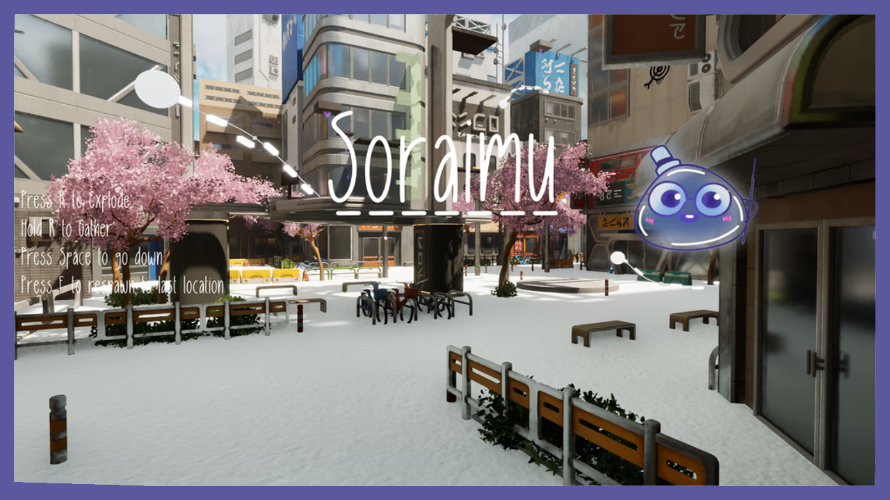
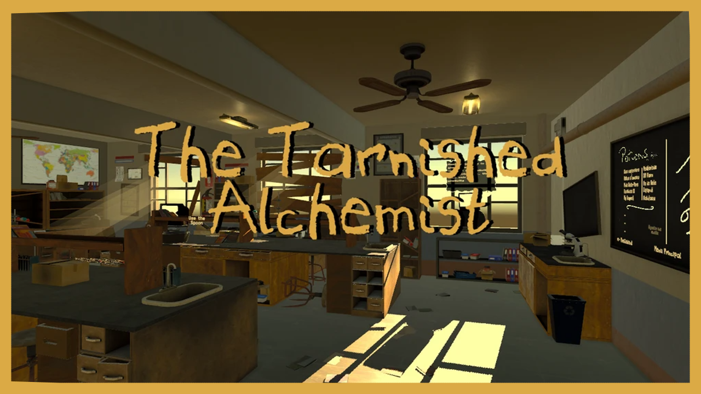
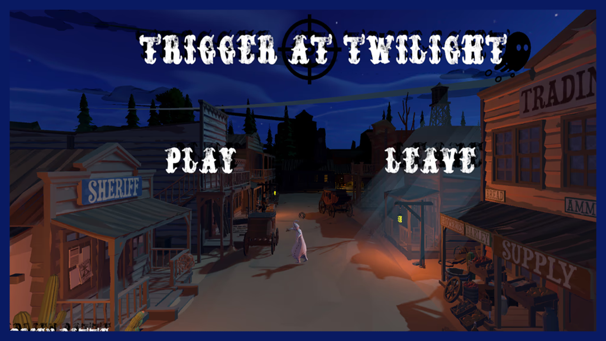
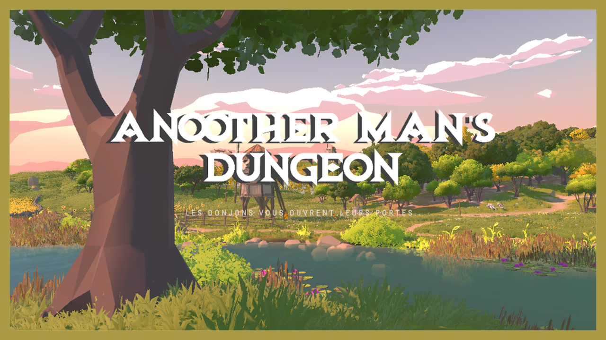

  

  

  
  &#8287;&#8287;&#8287;&#8287;&#8287;
  
  &#8287;&#8287;&#8287;&#8287;&#8287;
  
  &#8287;&#8287;&#8287;&#8287;&#8287;
  

---

  
  
  
  

  <!-- Tools -->
  
  
  
  

  
|---------------------------------------|---------------------------------------|

  

## About Me

- 🎮 Master 1 Game Development (La Défense)  
- 🕹️ Gameplay systems, physics-based mechanics, UE5 / UEFN  
- 🔌 Plugins & tools (Twitch × Unreal, automation, bots, helpers de prod)  

---

  

#### **Twitch StreamSync** – The all-in-one Twitch plugin for Unreal Engine

Connect your Unreal projects or games to Twitch in minutes, and interact with it in real-time!

**Features:**
- 🔐 **OAuth 2.0**: Secure authentication with automatic token refresh
- 💬 **Chat Integration**: WebSocket IRC with command system & moderation tools
- 📡 **EventSub**: Support for WebSocket & Webhook transports
- ⚡ **Helix API**: Stream title, game category, polls, predictions, channel points
- 🎮 **Dev Simulator**: Test redeems, subs, raids, and more without going live
- 📘 **Blueprint-First**: 80+ exposed nodes for rapid prototyping
- 🔧 **Production-Ready**: Rate limiting, reconnects, token validation, log redaction

**Available on:** [Fab Marketplace](https://www.fab.com/listings/97e1b3d0-df12-41eb-89f4-3e4e54f28fc4) | [Documentation](https://drive.google.com/file/d/1uR5sbjdLWhD4FhC4-CTITxnTPoYYra-X/view?usp=sharing) | [Discord](https://discord.gg/BwhyxQAAUn)

---

#### 🎞️ Screenshot gallery

  
  
  
  
  
  

---

  

